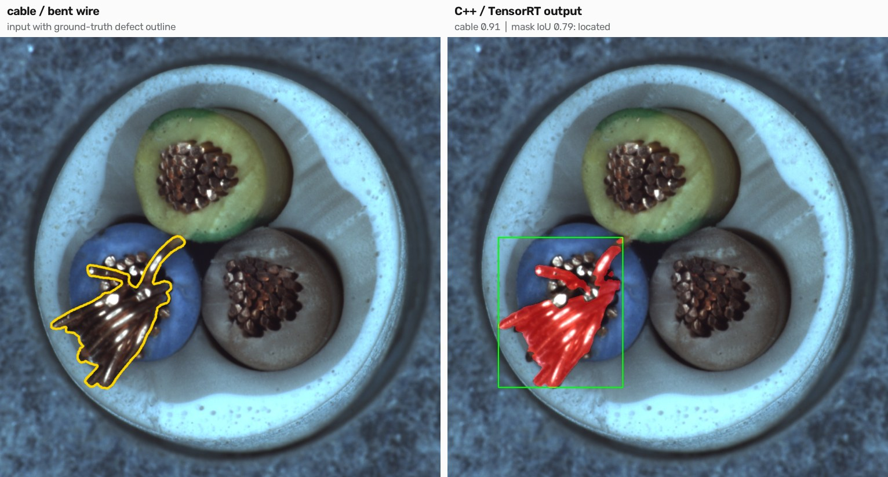
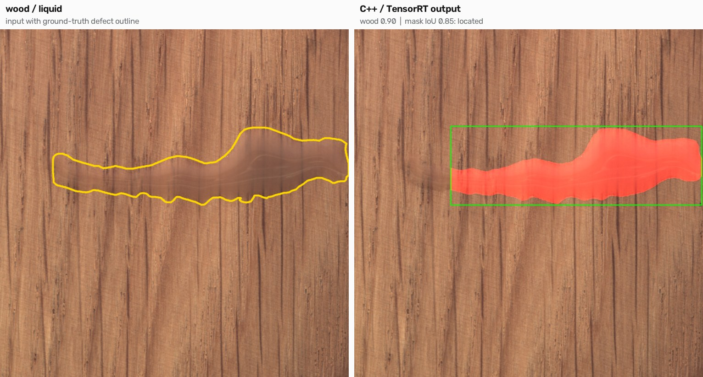
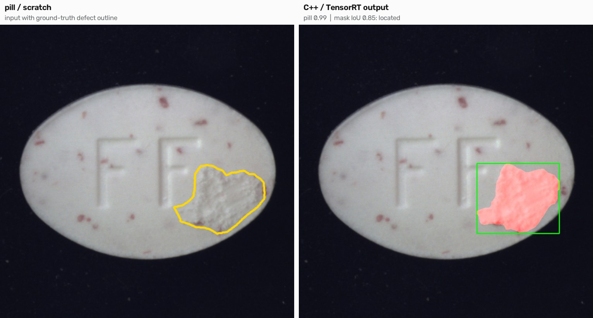
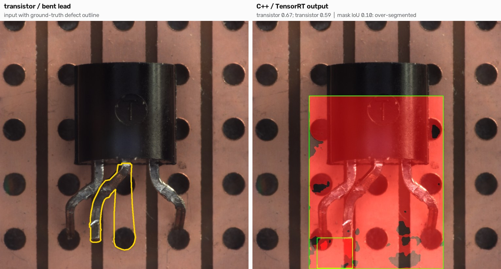
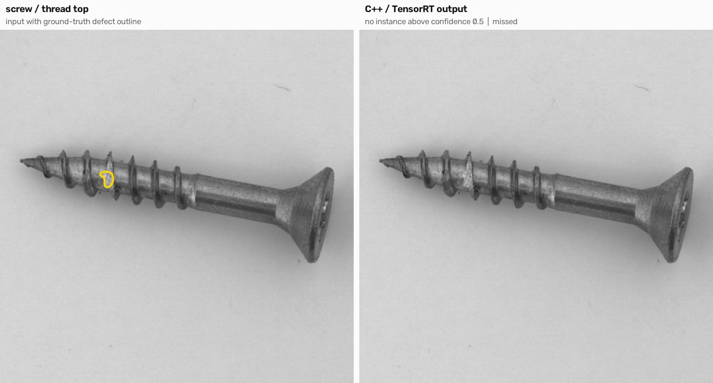
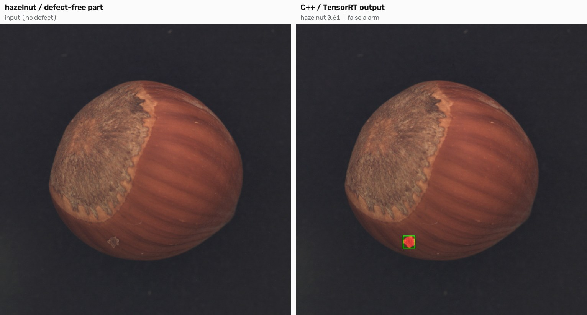
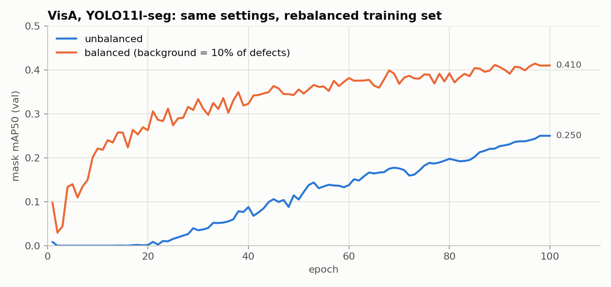
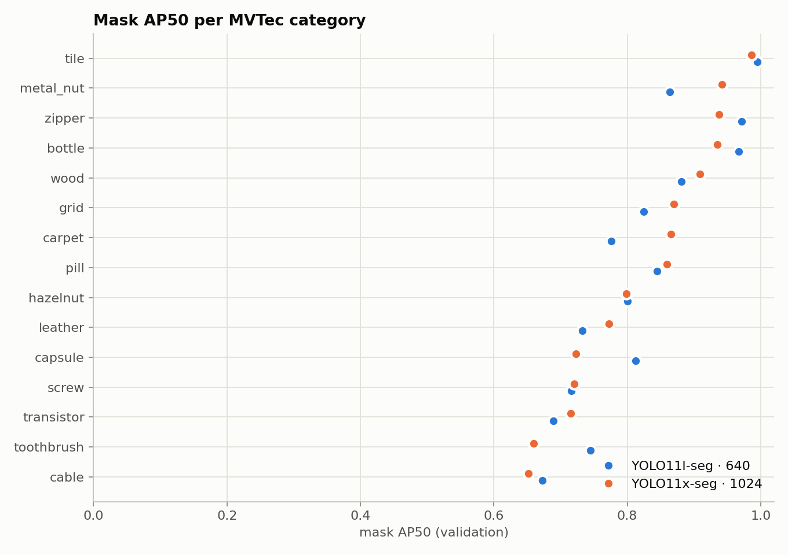
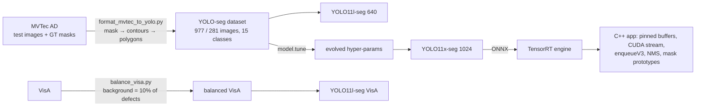

# Industrial Defect Segmentation (MVTec AD & VisA)

Pixel-level defect segmentation with YOLO11-seg. Each defect gets a mask plus the category of the part it sits on. The project covers dataset engineering, a training-set rebalancing experiment, hyperparameter evolution, evaluation on defect-free parts, and a TensorRT engine served from a hand-written C++ application.


<sub>A held-out validation image run through the C++/TensorRT application. Left: the ground-truth defect outline. Right: the app's box and mask output, with mask IoU 0.79 against the ground truth.</sub>

## Highlights

| | |
|---|---|
| **MVTec AD (15 categories)** | mask mAP50 **0.82**, mask mAP50-95 **0.48** (YOLO11l-seg, 640 px) |
| **C++ app on held-out parts** | **11 of 15** defects located at mask IoU ≥ 0.5, one per category. The predicted category was right for all 14 detected defects. |
| **Inference speed** | TensorRT engine for YOLO11x-seg at 1024×1024: **6.7 ms** mean, 7.2 ms p99 (`trtexec`, RTX 5080) |
| **Data > model size** | Rebalancing VisA's training set lifted mask mAP50 **0.25 → 0.41**. A 2.2× larger model at 4× the pixels gave **no** gain on MVTec. |
| **Defect-free parts** | On 467 good MVTec parts never seen in training, false alarms are **4.5%** at conf 0.25 and **2.1%** at conf 0.5 |

The full walkthrough, with code and rendered results, is in **[industrial_defect_segmentation.ipynb](industrial_defect_segmentation.ipynb)**.

## C++ / TensorRT demo on held-out parts

One random validation image per category (seed 0, never used for training) and two random defect-free parts were run through the C++ application, one image per case. Each result image shows the ground-truth outline in yellow on the left and the app's output on the right. The app paints its masks with a red tint, so [src/render_cpp_demo.py](src/render_cpp_demo.py) recovers the C++ mask from the output image and scores it against the ground truth.

| Case | C++ detection (confidence) | Mask IoU vs ground truth | Verdict |
|---|---|---|---|
| [bottle · broken small](results/cpp_demo/bottle_broken_small_017.jpg) | bottle (0.93) | 0.66 | located |
| [cable · bent wire](results/cpp_demo/cable_bent_wire_006.jpg) | cable (0.91) | 0.79 | located |
| [capsule · squeeze](results/cpp_demo/capsule_squeeze_012.jpg) | capsule (0.72) | 0.29 | over-segmented |
| [carpet · metal contamination](results/cpp_demo/carpet_metal_contamination_009.jpg) | carpet (0.93) | 0.83 | located |
| [grid · metal contamination](results/cpp_demo/grid_metal_contamination_004.jpg) | grid (0.89) | 0.78 | located |
| [hazelnut · cut](results/cpp_demo/hazelnut_cut_008.jpg) | hazelnut (0.82) | 0.77 | located |
| [leather · fold](results/cpp_demo/leather_fold_002.jpg) | leather (0.64) | 0.49 | partly covered |
| [metal nut · bent](results/cpp_demo/metal_nut_bent_023.jpg) | metal nut (0.94) | 0.60 | located |
| [pill · scratch](results/cpp_demo/pill_scratch_013.jpg) | pill (0.99) | 0.85 | located |
| [screw · thread top](results/cpp_demo/screw_thread_top_017.jpg) | none | 0.00 | **missed** |
| [tile · glue strip](results/cpp_demo/tile_glue_strip_015.jpg) | tile (0.97) | 0.98 | located |
| [toothbrush · defective](results/cpp_demo/toothbrush_defective_021.jpg) | toothbrush (0.92) | 0.88 | located |
| [transistor · bent lead](results/cpp_demo/transistor_bent_lead_008.jpg) | transistor ×2 (0.67, 0.59) | 0.10 | over-segmented |
| [wood · liquid](results/cpp_demo/wood_liquid_001.jpg) | wood (0.90) | 0.85 | located |
| [zipper · fabric border](results/cpp_demo/zipper_fabric_border_013.jpg) | zipper (0.91) | 0.77 | located |
| [hazelnut · defect-free](results/cpp_demo/hazelnut_good_013.jpg) | hazelnut (0.61) | – | **false alarm** |
| [screw · defect-free](results/cpp_demo/screw_good_035.jpg) | none | – | correct: nothing detected |

<p align="center"></p>
<p align="center"></p>

The failures are informative:

<p align="center"></p>
<sub>Right class, wrong extent. The bent lead is flagged, but the mask spreads over the whole transistor. Shape and position defects are harder to delineate than surface marks.</sub>

<p align="center"></p>
<sub>Missed. The damaged thread covers about 1,200 pixels, 0.1% of the image, and nothing clears the app's 0.5 confidence threshold.</sub>

<p align="center"></p>
<sub>False alarm on a defect-free part: a small surface speck. The other defect-free part, a screw, stays clean.</sub>

Every case, including the other ten, has its own image in [results/cpp_demo](results/cpp_demo).

## Model results

| Run | Box mAP50 | Box mAP50-95 | Mask mAP50 | Mask mAP50-95 |
|---|---|---|---|---|
| MVTec · YOLO11l-seg · 640 px · 100 ep | 0.830 | 0.567 | **0.819** | **0.482** |
| MVTec · YOLO11x-seg · 1024 px · evolved hyper-params · 150 ep | 0.831 | 0.535 | **0.823** | 0.473 |
| VisA · YOLO11l-seg · unbalanced | 0.281 | 0.136 | 0.250 | 0.118 |
| VisA · YOLO11l-seg · **balanced** (same settings) | 0.457 | 0.289 | **0.410** | 0.214 |

<sub>MVTec rows: `best.pt` re-validated per category with `src/eval_per_category.py`. VisA rows: final epoch of each run. The validation split also selected `best.pt`, so the MVTec numbers are slightly optimistic.</sub>

<p align="center">
  
  
</p>

- **Rebalancing mattered most.** The two VisA runs have identical settings. The only change is keeping background images at 10% of the defect count, which removed the 20-epoch stall at zero and raised mask mAP50 by 16 points.
- **Objects are harder than textures.** Cable, toothbrush, transistor, screw and capsule score 0.65–0.81 mask AP50, while tile reaches 0.99. Each category has only 6–31 validation images, so single-category differences are noisy.
- **Operational view.** The model was never shown a good part, so the threshold alone controls rejected good parts: 4.5% vs 8.8% for the 640 px and 1024 px models at conf 0.25, and about 2% for both at conf 0.5.
- **Hyperparameter evolution** completed only 2 of 20 iterations, so the "evolved" settings are a single mutation of the defaults. The notebook shows the tuner log.

## How it works



The C++ application ([cpp/trt_seg_inference/main.cpp](cpp/trt_seg_inference/main.cpp)) owns everything around the network. It pre-processes into a pinned CHW buffer, runs asynchronous H2D, `enqueueV3` and D2H on one stream, then decodes 21,504 proposals × (4 box + 15 class + 32 mask coefficients). NMS uses `cv::dnn::NMSBoxes`, and each instance mask is reconstructed as `sigmoid(coefficients · prototypes[32×256×256])`, upsampled and cropped to its box.

A TensorRT engine only loads with the TensorRT version that built it. After a TensorRT upgrade, the app crashed on the stale engine, so it now checks for a failed load and says so. The engine behind the demo was rebuilt from the same ONNX with `trtexec`.

## Repository layout

```
industrial_defect_segmentation.ipynb   end-to-end notebook (code + results)
src/format_mvtec_to_yolo.py            MVTec masks -> YOLO polygon labels (80/20 per defect type)
src/balance_visa.py                    background/defect rebalancing for VisA
src/train_and_export.py                YOLO11l-seg training + TensorRT export
src/train_final_1024.py                YOLO11x-seg @ 1024 with evolved hyper-parameters
src/export_tensorrt.py                 export an existing checkpoint to a TensorRT engine
src/eval_per_category.py               per-category AP + false-alarm rate on defect-free parts
src/render_cpp_demo.py                 one image per C++ demo case + mask IoU against ground truth
cpp/trt_seg_inference/                 C++17 TensorRT inference app (CMake) + run_demo.sh
results/cpp_demo/                      one image per held-out case, case list, per-case scores
results/figures/                       training curves, VisA balancing, per-category AP
results/metrics/                       per-run CSVs and args, tuning log, per-category and false-alarm tables
```

## Quick start

```bash
pip install -r requirements.txt
# MVTec AD: https://www.mvtec.com/company/research/datasets/mvtec-ad  (extract so that bottle/, cable/, ... sit in the working directory)
python src/format_mvtec_to_yolo.py                                   # -> mvtec_yolo/
yolo segment train data=mvtec_yolo/mvtec.yaml model=yolo11l-seg.pt epochs=100 imgsz=640 batch=16
python src/eval_per_category.py                                       # per-category AP + false alarms on good parts

# C++ / TensorRT
yolo export model=runs/segment/train/weights/best.pt format=onnx imgsz=1024
trtexec --onnx=best.onnx --saveEngine=best_1024.engine
cmake -S cpp/trt_seg_inference -B build && cmake --build build
bash cpp/trt_seg_inference/run_demo.sh build/inference best_1024.engine demo_raw results/cpp_demo/cases.csv .
python src/render_cpp_demo.py --mvtec . --cases results/cpp_demo/cases.csv --raw demo_raw --out results/cpp_demo
```

## Limitations and next steps

- No defect-free images were used in training. Adding them as background, and reporting image-level AUROC and pixel-level PRO as in the MVTec benchmark, would make the numbers comparable to published results.
- Hyperparameter search needs a smaller proxy model to finish more than 2 iterations on a 16 GB GPU.
- The engine is built from an FP32 graph. Next: an FP16 export, end-to-end timing of the C++ path including pre- and post-processing, and command-line arguments instead of fixed file names.

## Data & licenses

- **MVTec AD**: Bergmann et al., *MVTec AD — A Comprehensive Real-World Dataset for Unsupervised Anomaly Detection*, CVPR 2019. Licensed CC BY-NC-SA 4.0.
- **VisA**: Zou et al., *SPot-the-Difference Self-Supervised Pre-training for Anomaly Detection and Segmentation*, ECCV 2022. Licensed CC BY 4.0.
- Datasets and weights are not redistributed. Sample images in `results/` are model outputs on dataset images, shown for non-commercial illustration with attribution.
- **Ultralytics YOLO / RT-DETR** is used as a dependency under AGPL-3.0.
- Code: MIT (see [LICENSE](LICENSE)).
